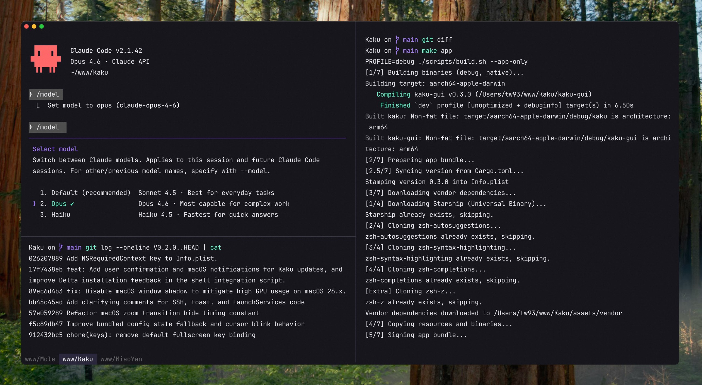

<div align="center">
  
  <h1>Kaku</h1>
  <p><em>A fast, GPU-accelerated terminal emulator for macOS, forked from WezTerm.</em></p>
</div>

<p align="center">
  <a href="https://github.com/niasand/Kaku/stargazers"></a>
  <a href="https://github.com/niasand/Kaku/releases"></a>
  <a href="LICENSE.md"></a>
  <a href="https://github.com/niasand/Kaku/commits"></a>
</p>

<p align="center">
  
</p>

## Why

Kaku (書く, かく) is the Japanese word for writing: the act of putting thought into form. A deeply customized fork of WezTerm, built for practical defaults on day one while keeping full Lua customization and a fast, lightweight feel.

Part of a trilogy: [Kaku](https://github.com/niasand/Kaku) (書く) writes code, [Waza](https://github.com/tw93/Waza) (技) drills habits, [Kami](https://github.com/tw93/Kami) (紙) ships documents. Think of them as a family: Kaku is the dad, Waza the big sister, Kami the little sister.

## Features

- **Zero Config**: Defaults with JetBrains Mono, macOS font rendering, and tuned line height out of the box.
- **Theme-Aware**: Auto-switches between dark and light modes with macOS. Includes curated Kaku Dark and Kaku Cream color schemes with Claude Code color overrides.
- **GPU-Accelerated Rendering**: OpenGL and WebGPU (Metal) backends for smooth, high-FPS terminal output.
- **Shell Suite**: Built-in zsh plugins (z, zsh-completions, zsh-autosuggestions, fast-syntax-highlighting) and optional CLI tools (starship, delta, lazygit).
- **Polished Defaults**: Copy on select, clickable file paths, history peek from full-screen apps, pane input broadcast, and visual bell on background tab completion.
- **Session Restore**: Window layout, tab names, and pane working directories are saved and restored across restarts.
- **Lazygit Integration**: Open lazygit in a dedicated pane with `Cmd + Shift + G`. Smart detection of git repos and AI agent processes.
- **Config TUI**: Interactive terminal-based config editor via `kaku config` or `Cmd + ,`.
- **WezTerm-Compatible Config**: Use WezTerm's Lua config directly with full API compatibility and no migration.

## Quick Start

1. [Download Kaku DMG](https://github.com/niasand/Kaku/releases/latest) & Drag to Applications
2. Open Kaku. The app is notarized by Apple, so it opens without security warnings
3. On first launch, Kaku will automatically set up your shell environment

## Usage Guide

| Action | Shortcut |
| :--- | :--- |
| New Tab | `Cmd + T` |
| New Window | `Cmd + N` |
| Close Tab/Pane | `Cmd + W` |
| Navigate Tabs | `Cmd + Shift + [` / `]` or `Cmd + 1–9` |
| Navigate Panes | `Cmd + Opt + Arrows` |
| Split Pane Vertical | `Cmd + D` |
| Split Pane Horizontal | `Cmd + Shift + D` |
| Open Settings | `Cmd + ,` |
| Open Lazygit | `Cmd + Shift + G` |
| Toggle Pane Broadcast | `Cmd + Opt + I` |
| Clear Screen | `Cmd + K` |

Full keybinding reference: [docs/keybindings.md](docs/keybindings.md)

## Performance

| Metric | Upstream WezTerm | Kaku | Methodology |
| :--- | :--- | :--- | :--- |
| **Executable Size** | ~67 MB | ~40 MB | Aggressive symbol stripping & feature pruning |
| **Resources Volume** | ~100 MB | ~80 MB | Asset optimization & lazy-loaded assets |
| **Launch Latency** | Standard | Instant | Just-in-time initialization |
| **Shell Bootstrap** | ~200ms | ~100ms | Optimized environment provisioning |

## CLI

```bash
kaku                   # Interactive main menu (config/init/doctor/reset)
kaku config            # Open config TUI editor
kaku init              # Set up shell integration (zsh/fish)
kaku doctor            # Diagnose and fix common issues
kaku reset             # Remove all Kaku managed state
kaku start             # Launch the GUI terminal
kaku set-working-directory  # Set CWD via OSC 7
```

## FAQ

**Is there a Windows or Linux version?** Not currently. Kaku is macOS-only for now.

**Can I use transparent windows?** Yes, set `config.window_background_opacity` in `~/.config/kaku/kaku.lua`.

**The `kaku` command is missing.** Run `/Applications/Kaku.app/Contents/MacOS/kaku init --update-only && exec zsh -l`, then `kaku doctor`.

Full FAQ: [docs/faq.md](docs/faq.md)

## Docs

- [Keybindings](docs/keybindings.md) — full shortcut reference
- [Features](docs/features.md) — lazygit, shell suite, session restore
- [Configuration](docs/configuration.md) — themes, fonts, custom keybindings, Lua API
- [CLI Reference](docs/cli.md) — `kaku config`, `kaku doctor`, `kaku init`, and more
- [FAQ](docs/faq.md) — common questions and troubleshooting

## Background

I heavily rely on the CLI for both work and personal projects. Tools I've built, like [Mole](https://github.com/tw93/mole) and [Pake](https://github.com/tw93/pake), reflect this.

I used Alacritty for years and learned to value speed and simplicity. As my workflow shifted toward AI-assisted coding, I wanted stronger tab and pane ergonomics. I also explored Kitty, Ghostty, Warp, and iTerm2. Each is strong in different areas, but I still wanted a setup that matched my own balance of performance, defaults, and control.

WezTerm is robust and highly hackable, and I am grateful for its engine and ecosystem. So I built Kaku to be that environment: fast, polished, and ready to work.

## Contributors

Big thanks to all contributors who helped build Kaku. Go follow them! ❤️

<a href="https://github.com/niasand/Kaku/graphs/contributors">
  
</a>

## Support

- If Kaku helped you, [share it](https://twitter.com/intent/tweet?url=https://github.com/niasand/Kaku&text=Kaku%20-%20A%20fast%20terminal%20built%20for%20AI%20coding.) with friends or give it a star.
- Got ideas or bugs? Open an issue or PR, feel free to contribute your best AI model.
- I have two cats, TangYuan and Coke. If you think Kaku delights your life, you can feed them <a href="https://cats.tw93.fun?name=Kaku" target="_blank">canned food 🥩</a>.

<a href="https://cats.tw93.fun?name=Kaku"></a>

## License

MIT License, feel free to enjoy and participate in open source.
